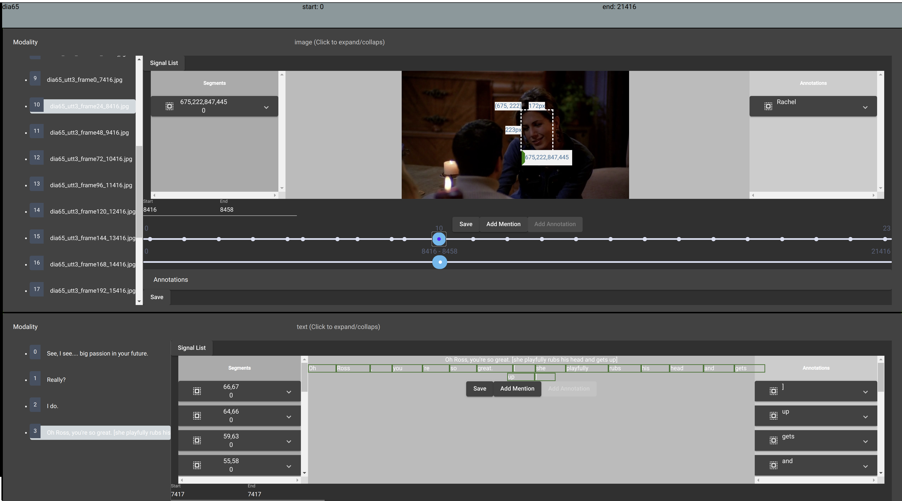
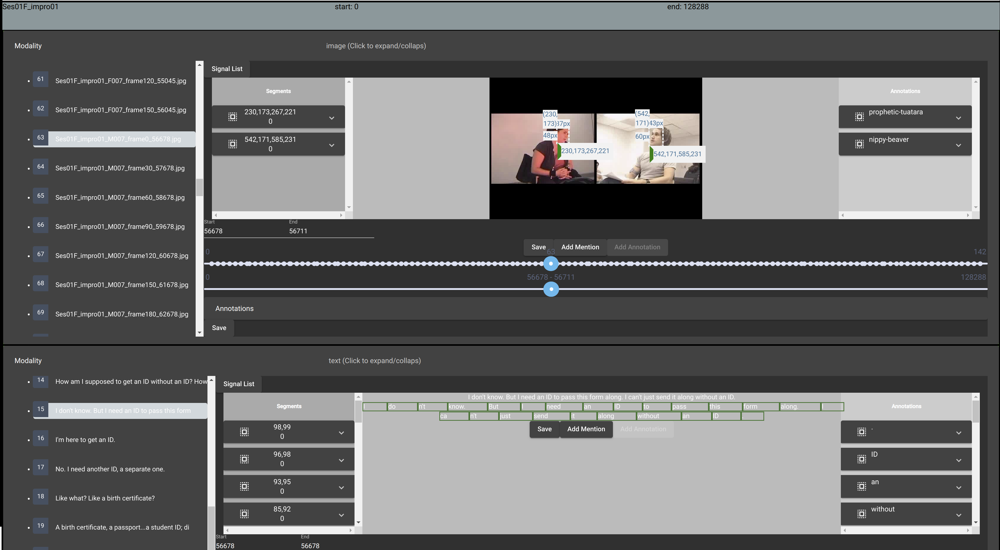

# Example data

Some of the data here are annotated manually while some are done by the machine. We are trying to avoid manual human labor as less as possible.

Things that are done by the machine:

1. Face detection (bouding box)
1. Face recognition
    * The machine groups the same faces and give them a random name. You still have to name them manually afterwards but this is very trivial.
1. Age recognition
    * Not perfect, but cool.
1. Sex recognition
    * Not perfect and a bit controversial.

Things that *will* be done by the machine in the future:

1. RDF Triple generation
1. Support for some common and useful ontologies.

## Screenshots

### CarLani

This is a simple dialogue between the human (Carl) and the robot (Leolani), where Leolani helps Carl with finding the pills that he is looking for. Such a use case might be very useful in the eldery care.

### MELD

MELD is a public dataset. The below image shows one small example from it.

### IEMOCAP

IEMOCAP is a public dataset. The below image shows one small example from it.

